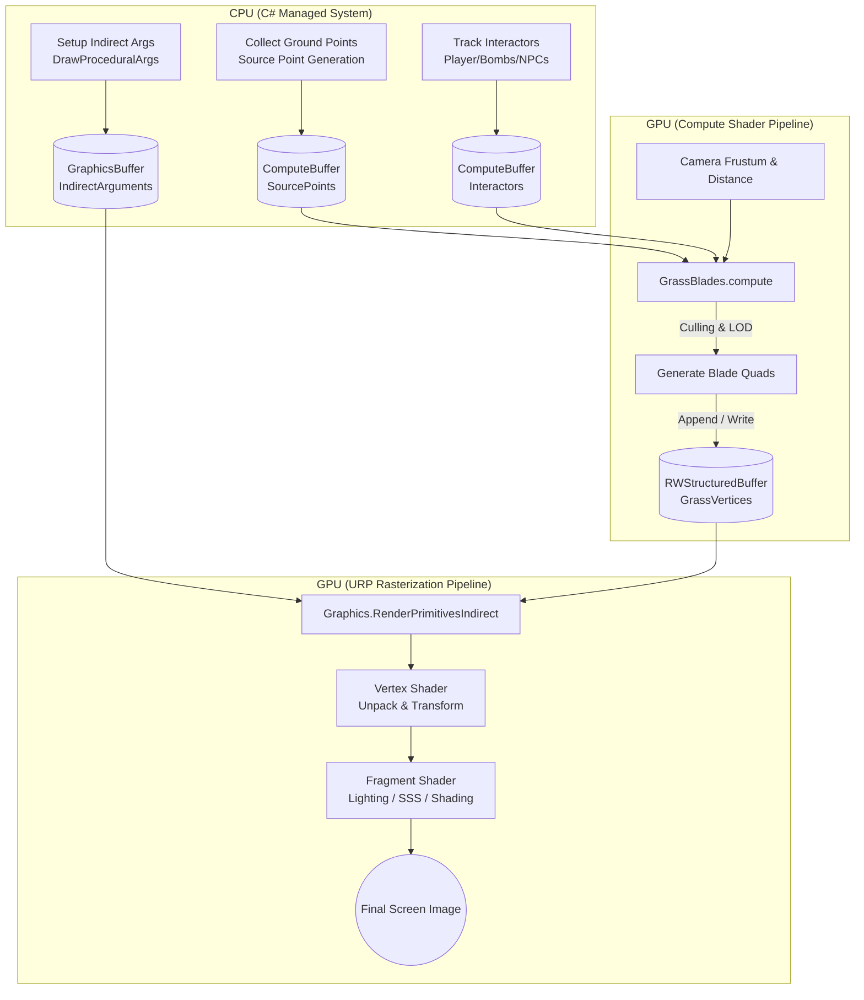

# GPU Grass System Development Roadmap (အစအဆုံး ကိုယ်တိုင်တည်ဆောက်ရန် ပြည့်စုံသော လမ်းညွှန်စာတမ်း)

> **စာတမ်းရည်ရွယ်ချက်**: 
> ဤစာတမ်းသည် Unity (Universal Render Pipeline - URP) တွင် Compute Shader နှင့် Indirect Drawing Pipeline ကို အသုံးပြု၍ AAA အဆင့်မီ **GPU Procedural Grass System** တစ်ခုလုံးကို အစအဆုံး ကိုယ်တိုင် အဆင့်ဆင့် ရေးသားတည်ဆောက်နိုင်ရန်အတွက် ပြုစုထားသော ပြည့်စုံသည့် Technical Roadmap နှင့် Architectural Blueprint ဖြစ်သည်။

---

## ၁။ စနစ်တစ်ခုလုံး၏ Architecture ဖွဲ့စည်းပုံ အကျဉ်းချုပ် (High-Level Overview)

သာမန် Unity GameObjects (MeshRenderer) ဖြင့် မြက်ပင် ထောင်သောင်းချီ ဆွဲပါက CPU Draw Call overhead ကြောင့် ဂိမ်း lag သွားမည်ဖြစ်သည်။ ဤစနစ်သည် **GPU Driven Indirect Architecture** ကို အသုံးပြုထားသောကြောင့် CPU သည် Frame တိုင်းတွင် Draw Call တစ်ခုတည်းသာ ထုတ်ပေးပြီး ကျန်ရှိသော တွက်ချက်မှုနှင့် ဂျီဩမေတြီ ထုတ်လုပ်မှုအားလုံးကို GPU ပေါ်တွင် သီးသန့် တွက်ချက်ပါသည်။



---

## ၂။ အဆင့် ၁၀ ဆင့် အသေးစိတ် ဖွံ့ဖြိုးတိုးတက်မှု အစီအစဉ် (Detailed 10-Phase Roadmap)

---

### Phase 1: GPU Architecture & Indirect Drawing Pipeline (အခြေခံအုတ်မြစ်)

* **ရည်ရွယ်ချက်**: Unity ၏ သာမန် GameObject များကို လုံးဝမသုံးဘဲ GPU Compute Buffer မှ Data များကို ဖတ်၍ GPU ပေါ်တွင် မျက်ရည်တစ်ပေါက်မကျဘဲ Procedural Geometry ဆွဲနိုင်သော Pipeline ကို တည်ဆောက်ခြင်း။
* **နည်းပညာ သဘောတရား**:
  - `Graphics.DrawProceduralIndirect` သို့မဟုတ် `Graphics.RenderPrimitivesIndirect` ကို အသုံးပြုခြင်း။
  - **Indirect Arguments Buffer**: ကိန်းဂဏန်း (uint) ၅ ခုပါဝင်သော Buffer (`VertexCountPerInstance`, `InstanceCount`, `StartVertexLocation`, `StartInstanceLocation`, `Args5`) ကို အသုံးပြု၍ GPU က ဆွဲရမည့် အရေအတွက်ကို GPU ကိုယ်တိုင် ဆုံးဖြတ်စေခြင်း။
* **Data Structures**:
  ```hlsl
  struct SourcePoint {
      float3 positionWS; // မြက်ပေါက်မည့် နေရာ
      float3 normalWS;   // မြေပြင် မျက်နှာပြင် Normal
      float2 scale;      // Width, Height Scale
      uint hash;         // Random Seed Hash
  };
  ```
* **ဖန်တီးရမည့် ဖိုင်များ**:
  1. `GrassManager.cs` (C# Controller - Buffer Allocation & Dispatch logic)
  2. `GrassBlades.compute` (Compute Shader - Geometry Generation Kernel)
  3. `GrassShader.shader` (URP Procedural Vertex/Fragment Shader)
* **အောင်မြင်မှု စစ်ဆေးခြင်း (Milestone)**:
  - Game View တွင် Triangle သို့မဟုတ် Quad ပြားလေးများ GPU မှ Draw Call ၁ ခုတည်းဖြင့် သောင်းနှင့်ချီ ပေါ်လာခြင်း။

---

### Phase 2: Procedural Blade Geometry & Clump Clustering (မြက်ပင်ဂျီဩမေတြီနှင့် အစုလိုက်ဖွဲ့စည်းပုံ)

* **ရည်ရွယ်ချက်**: 3D Model တင်စရာမလိုဘဲ ကုတ်နံပါတ်ဖြင့် မြက်ရွက်တစ်ရွက်ချင်းစီ၏ ပုံသဏ္ဌာန် (Ribbon Strip) နှင့် အစေ့တစ်စေ့မှ မြက် ၃-၅ ပင် ကားထွက်သည့် Clump ပုံစံ တည်ဆောက်ခြင်း။
* **နည်းပညာ သဘောတရား**:
  - **Segment Ribbon**: မြက်ပင်တစ်ပင်ကို အောက်ခြေမှ ထိပ်ဖျားအထိ အဆစ် (Segments) $N$ ဆစ် ပိုင်းခြားပြီး Vertices များကို ဘယ်/ညာ တွဲလျက် ထုတ်ပေးခြင်း ($N$ segments = $(N+1) \times 2$ vertices)။
  - **Width Tapering Formula**: အောက်ခြေမှ အထက်သို့ သွယ်လျသွားစေရန်:
    $$\text{width}(t) = \text{baseWidth} \times (1.0 - t^{1.5})$$
    (နေရာတွင် $t \in [0, 1]$ သည် အောက်ခြေမှ ထိပ်ဖျားသို့ အချိုးဖြစ်သည်)
  - **Blade Curvature (ကွေးညွတ်မှု သင်္ချာ)**:
    $$\vec{P}(t) = \text{Root} + \vec{U} \cdot (\text{Height} \cdot t) + \vec{F} \cdot (\text{Tilt} \cdot t^2)$$
  - **Clumping (Radial Dispersal)**: အလယ်ဗဟိုမှ ပတ်လည် 360 ဒီဂရီအတွင်း Golden Angle ($\approx 137.5^\circ$) သို့မဟုတ် Pseudo-random Angle ဖြင့် အပြင်ဘက်သို့ ကားထွက်စေခြင်း။
* **အောင်မြင်မှု စစ်ဆေးခြင်း (Milestone)**:
  - ပြားချပ်ချပ် စက္ကူပြားပုံစံမဟုတ်ဘဲ သဘာဝအတိုင်း အဆစ်ဆစ်ကွေးညွတ်နေသော မြက်ရုံ (Tufts/Clumps) များ ဖြစ်ပေါ်လာခြင်း။

---

### Phase 3: Color Gradients, Ground Blending & Normal Up-Blend (အရောင်နှင့် မြေပြင်ပေါင်းစပ်မှု)

* **ရည်ရွယ်ချက်**: မြက်ပင်များသည် မြေကြီးနှင့် ကွဲထွက်မနေဘဲ သဘာဝအတိုင်း တစ်သားတည်း ပေါင်းစပ်သွားစေရန်နှင့် အလင်းကျရာတွင် နူးညံ့ချောမွေ့စေရန်။
* **နည်းပညာ သဘောတရား**:
  - **Vertical Color Gradient**: မြက်အောက်ခြေတွင် အစိမ်းရင့်/အညို (`_BottomColor`) မှ ထိပ်ဖျားတွင် နေရောင်ဟပ်နေသော စိမ်းနုရောင် (`_TopColor`) သို့ ဒေါင်လိုက် ရောစပ်ခြင်း။
  - **Ground Orthographic Capture**: Orthographic Camera ကို မြေပြင်အထက်မှ အောက်သို့ ချိန်ပြီး မြေပြင်၏ Albedo Texture ကို Texture2D တစ်ခုအဖြစ် ကြိုတင်ဖမ်းယူ (Bake) ထားကာ မြက်ပင်၏ Root ကမ္ဘာ့တည်နေရာ $(x, z)$ ဖြင့် UV ဖတ်ယူပြီး အောက်ခြေအရောင်နှင့် ရောစပ်ခြင်း။
  - **Normal Up-Blending (အရေးကြီးဆုံး လျှို့ဝှက်ချက်)**:
    $$\vec{N}_{\text{shading}} = \text{normalize}(\text{lerp}(\vec{N}_{\text{blade}}, \text{float3}(0, 1, 0), \alpha_{\text{blend}}))$$
    မြက်ရွက်ပြား၏ Normal ကို အပေါ်တည့်တည့် $(0, 1, 0)$ ဘက်သို့ ၆၀% မှ ၈၀% ညွတ်ပေးခြင်းဖြင့် အလင်းရောင်ကျသောအခါ မြက်ရွက်တစ်ခုချင်း ကြမ်းတမ်းစွာ ဖြူမသွားဘဲ ကော်ဇောခင်းထားသကဲ့သို့ နူးညံ့စွာ လင်းလက်စေပါသည်။
* **အောင်မြင်မှု စစ်ဆေးခြင်း (Milestone)**:
  - မြက်ခင်းနှင့် မြေကြီးကြား မျဉ်းကြောင်းပြတ်တောက်မှု မရှိတော့ဘဲ မြေကြီးထဲမှ အမှန်တကယ် ပေါက်ထွက်လာသကဲ့သို့ ဖြစ်သွားခြင်း။

---

### Phase 4: World-Space Noise Variations (Color & Height/Density) (သဘာဝအတိုင်း ကွဲပြားမှု)

* **ရည်ရွယ်ချက်**: မြက်ပင်များအားလုံး အရပ်တညီတည်း၊ အရောင်တသမတ်တည်းဖြစ်နေသည့် ကွန်ပျူတာအတုကြီးပုံစံကို ဖျောက်ဖျက်ခြင်း။
* **နည်းပညာ သဘောတရား**:
  - **2D Simplex / Perlin Noise in HLSL**: မြက်ပင်ပေါက်သည့် ကမ္ဘာ့တည်နေရာ $(x, z)$ ကို Input ပေး၍ Noise Value $N \in [0, 1]$ တွက်ချက်ခြင်း။
  - **Macro Color Variation**: ကြီးမားသော Noise Frequency ကို သုံးပြီး ကွင်းပြင်ကြီးထဲတွင် အစိမ်းရင့်ကွက်များ၊ မြက်ခြောက်အဝါကွက်များနှင့် အစိုဓာတ်ရှိသော အကွက်များအဖြစ် ရောစပ်ခြင်း။
  - **Height & Density Modulation**: အလယ်အလတ် Noise ကို သုံး၍ မြက်ပင်တို့၏ အမြင့် (`Height`) ကို အတိုအရှည် ကွဲပြားစေခြင်းနှင့် သဘာဝအတိုင်း မြက်နည်းသည့် မြေကွက်လပ်လေးများ ဖန်တီးခြင်း။
* **အောင်မြင်မှု စစ်ဆေးခြင်း (Milestone)**:
  - အဝေးမှကြည့်လျှင်လည်းကောင်း၊ အနီးမှကြည့်လျှင်လည်းကောင်း မျက်စိပသာဒရှိသော သဘာဝကွင်းပြင်ကြီးအသွင် ပေါ်လွင်လာခြင်း။

---

### Phase 5: Physics-Based Wind Simulation (လေလှိုင်းနှင့် လှုပ်ရှားမှု ရူပဗေဒ)

* **ရည်ရွယ်ချက်**: လေပြေလေညင်းနှင့် လေပြင်းတိုက်ခတ်မှုများကို လှိုင်းလုံးကြီးများသဖွယ် သဘာဝအတိုင်း ယိမ်းထိုးစေခြင်း။
* **နည်းပညာ သဘောတရား**:
  - **Directional Scrolling Noise**: လေတိုက်သည့် ဦးတည်ရာ Direction Vector $\vec{W}_{\text{dir}}$ အတိုင်း အချိန်နှင့်အမျှ ရွေ့လျားနေသော Gust Texture/Noise ကို တွက်ခြင်း။
  - **Tip-Biased Quadratic Bending**: မြက်ခြေရင်းသည် မြေကြီးတွင် မြဲနေရမည်ဖြစ်ပြီး ထိပ်ဖျားသာ အများဆုံး ကွေးရမည်ဖြစ်သောကြောင့်:
    $$\Delta \vec{P} = \vec{W}_{\text{vector}} \times (\text{heightFraction})^2 \times \text{windStrength}$$
  - **Multi-Harmonic Waves**: ပင်မလေလှိုင်းကြီး (Low-frequency wave)၊ ဘေးတိုက်လှုပ်ခါမှု (Cross-wind turbulence) နှင့် မြက်ဖျားလေးများ တဆတ်ဆတ်တုန်ခါမှု (High-frequency chatter) သုံးခုကို ပေါင်းစပ်တွက်ချက်ခြင်း။
* **အောင်မြင်မှု စစ်ဆေးခြင်း (Milestone)**:
  - ပင်လယ်လှိုင်းများကဲ့သို့ မြက်ခင်းပြင်ကြီးပေါ်တွင် လေလှိုင်းများ ဖြတ်ပြေးသွားသည်ကို ရှင်းလင်းစွာ မြင်တွေ့ရခြင်း။

---

### Phase 6: Multi-Entity Real-Time Interactivity (ကစားသမားနှင့် ရူပဗေဒ ထိတွေ့မှု)

* **ရည်ရွယ်ချက်**: Player၊ ရန်သူများ၊ မော်တော်ယာဉ်များနှင့် ပေါက်ကွဲမှုများကြောင့် မြက်ပင်များ တွန်းဖယ်ခံရခြင်းနှင့် လှုပ်ခါမှု တုံ့ပြန်ခြင်း။
* **နည်းပညာ သဘောတရား**:
  - **Interactor StructuredBuffer**: ရွေ့လျားနေသော အရာဝတ္ထုများ၏ $(Position, Velocity, Radius, Strength)$ များကို GPU သို့ အချိန်နှင့်တပြေးညီ ပေးပို့ခြင်း။
  - **Footstep Contact Flattening**: ကစားသမား၏ အောက်ခြေရှိ မြက်ပင်များကို ဗဟိုမှ အပြင်ဘက်သို့ တွန်းဖယ်ခြင်း (Radial Push)။
  - **Damped Harmonic Spring Physics**: လူဖြတ်သွားပြီးသည့်နောက် မြက်ပင်သည် ချက်ချင်း မတ်မတ်မရပ်ဘဲ ကြိုးခုန်သလို ရှေ့နောက် တုန်ခါကာ ဖြည်းဖြည်းချင်း ပြန်ငြိမ်သက်သွားစေရန် Damped Sine Oscillator ($f \approx 1.8\text{ Hz}$, $e^{-\zeta \omega t}$) ဖြင့် တွက်ချက်ခြင်း။
  - **Explosion Blast Shockwave**: ဗုံးပေါက်ကွဲသည့်အခါ ကျယ်ပြန့်သွားသော စက်ဝိုင်းလှိုင်း (Expanding Ring Ripple) ဖြင့် မြက်များကို မြေပြင်တွင် ပြားကပ်သွားစေခြင်း။
* **အောင်မြင်မှု စစ်ဆေးခြင်း (Milestone)**:
  - ကစားသမား ပြေးလွှားသွားရာ လမ်းတစ်လျှောက်တွင် မြက်များ တွန်းဖယ်လှုပ်ရှားကာ ပြန်ကန်ထွက်လာခြင်း၊ ဗုံးပေါက်ကွဲလျှင် Shockwave လှိုင်းလုံးကြီး ပြန့်သွားခြင်း။

---

### Phase 7: Advanced URP Lighting, Shadows & Translucency (SSS) (အလင်းစနစ်နှင့် ဖောက်ထွင်းမှု)

* **ရည်ရွယ်ချက်**: AAA Game Engine အဆင့်မီ Foliage Shading၊ Subsurface Scattering နှင့် Shadow Rendering ရရှိစေရန်။
* **နည်းပညာ သဘောတရား**:
  - **URP Forward+ Additional Lights**: Directional Light အပြင် မီးတုတ်၊ မီးသီး (Point/Spot Lights) များ၏ အလင်းပါ မြက်ပေါ်သို့ ကျရောက်စေခြင်း။
  - **Subsurface Scattering (Backlight Translucency Formula)**:
    $$I_{\text{SSS}} = \text{pow}(\text{saturate}(\text{dot}(-\vec{L}, \vec{V})), \text{power}) \times \vec{C}_{\text{light}} \times \text{TranslucencyFactor}$$
    နေရောင်ကို မျက်နှာချင်းဆိုင်၍ နောက်ခံထားကြည့်သည့်အခါ မြက်ရွက်ပါးလေးများအတွင်း နေရောင်ဖောက်ထွင်းပြီး စိမ်းဝင်းလင်းလက်လာစေခြင်း။
  - **Ambient Spherical Harmonics**: `SampleSH(normalWS)` ဖြင့် မိုးကောင်းကင်နှင့် မြေပြင်မှ ပြန်ကန်ထွက်သော သဘာဝ Ambient Light ကို ဖမ်းယူခြင်း။
  - **Shadow Caster Pass**: မြက်ပင်တို့က မြေပြင်ပေါ်သို့ အချင်းချင်း အရိပ်ထိုးကျစေခြင်း။
* **အောင်မြင်မှု စစ်ဆေးခြင်း (Milestone)**:
  - နေဝင်ချိန် သို့မဟုတ် နေထွက်ချိန်တွင် မြက်ခင်းပြင်ကြီးသည် ရွှေရောင်/စိမ်းဝင်းဝင်း အလင်းရောင်များဖြင့် Cinematic ဆန်စွာ အလွန်လှပလာခြင်း။

---

### Phase 8: High-Performance GPU Frustum Culling & Distance LOD (စွမ်းဆောင်ရည် အကောင်းဆုံးဖြစ်အောင် ပြုပြင်ခြင်း)

* **ရည်ရွယ်ချက်**: မြက်ပင် သန်းချီရှိနေသည့် ဧရာမ Open-World ကမ္ဘာတွင်ပင် 60 - 120+ FPS မကျဘဲ ချောမွေ့စွာ ပြေးနိုင်စေရန်။
* **နည်းပညာ သဘောတရား**:
  - **6-Plane Camera Frustum Culling**: Compute Shader ထဲတွင် ကင်မရာ၏ မြင်ကွင်းမျက်နှာပြင် ၆ ခု (Left, Right, Bottom, Top, Near, Far) ၏ အပြင်ဘက်သို့ ရောက်နေသော မြက်ပင်များကို Bounding Sphere Test ဖြင့် ဂျီဩမေတြီ မထုတ်လုပ်မီ ကြိုတင် ဖယ်ထုတ်ခြင်း။
  - **Distance-Based Segment LOD**: 
    - ကင်မရာနှင့် နီးသော နေရာတွင်: Segment ၅ ဆစ် (ကွေးညွတ်ပြီး ချောမွေ့မှု အပြည့်)
    - အလယ်အလတ်တွင်: Segment ၃ ဆစ်
    - အဝေးတွင်: Segment ၁ ဆစ် သို့မဟုတ် ၂ ဆစ် (Vertices သန်းပေါင်းများစွာ လျှော့ချနိုင်သည်)
  - **Screen-Door Dither Alpha Fade**: Max Draw Distance သို့ ရောက်သောအခါ မြက်ပင်များ ရုတ်တရက် ပျောက်ကွယ်မသွားဘဲ မျက်စိမသိသာစေဘဲ မှိန်ဖျော့ ပျောက်ကွယ်စေခြင်း။
* **အောင်မြင်မှု စစ်ဆေးခြင်း (Milestone)**:
  - Frame Rate (FPS) သိသာစွာ ခုန်တက်လာပြီး မြက်ပင် သန်းချီတွင် GPU/CPU overhead မရှိတော့ခြင်း။

---

### Phase 9: Interactive Cutting & Dynamic Regrowth System (ခုတ်ထစ်ခြင်းနှင့် ပြန်လည်ရှည်ထွက်ခြင်း)

* **ရည်ရွယ်ချက်**: ဓားခုတ်ခြင်း၊ မြက်ရိတ်ခြင်း၊ ဗုံးဒဏ်ကြောင့် ပြတ်တောက်ခြင်းနှင့် အချိန်တန်လျှင် မြေကြီးထဲမှ သဘာဝအတိုင်း ပြန်ရှည်ထွက်လာခြင်း။
* **နည်းပညာ သဘောတရား**:
  - **Spatial Cut Grid / Dynamic Cut Texture**: ဖြတ်တောက်ခံရသည့် တည်နေရာ၊ အချင်း၊ ဖြတ်ခံရသည့် အမြင့်နှင့် အချိန် (Timestamp) ကို GPU သို့ မှတ်တမ်းတင် ပို့ဆောင်ခြင်း။
  - **GPU Vertex Truncation**: Fragment Shader သို့မဟုတ် Compute Shader တွင် ဓားခုတ်ခံရသည့် အမြင့်ထက် ကျော်လွန်နေသော အပိုင်းကို `discard` လုပ်ပစ်ပြီး အောက်ခြေအငုတ်စိမ်းလေးများကို ချန်ထားခြင်း။
  - **Dynamic Time Regrowth**: Delta Time အလိုက် တဖြည်းဖြည်းချင်း အပင်အမြင့်ကို မူလအမြင့်သို့ ပြန်လည် ကြီးထွားရှည်ထွက်စေသော Interpolation Curve ထည့်သွင်းခြင်း။
* **အောင်မြင်မှု စစ်ဆေးခြင်း (Milestone)**:
  - ကစားသမား ဓားခုတ်လိုက်သည့် နေရာတွင် မြက်ပင်များ အတိုလေးများ ဖြစ်ကျန်ခဲ့ပြီး၊ မိနစ်အနည်းငယ်အတွင်း သဘာဝအတိုင်း ပြန်ရှည်လာခြင်း။

---

### Phase 10: Cellular Automaton Wildfire Simulation & Synchronized VFX (မီးလောင်ကျွမ်းမှုနှင့် VFX စနစ်)

* **ရည်ရွယ်ချက်**: မြက်ခင်းပြင် မီးကူးစက်လောင်ကျွမ်းခြင်း၊ အပူဟပ်သော မီးလောင်ပြင် အစွန်းရှိ အပင်ရှည်များ ထိပ်ဖျားမဲသွားခြင်းနှင့် မီးတောက်အမှုန် (Fire VFX) များ တပြေးညီ လိုက်ပါလှုပ်ရှားခြင်း။
* **နည်းပညာ သဘောတရား**:
  - **4-Channel 2D Ping-Pong Simulation**:
    - **R (Scorch)**: မီးကျွမ်းအမာရွတ် (Charred Ash)
    - **G (Flame)**: မီးတောက်ပြင်းအားနှင့် တောက်ပမှု (Ember/Flame)
    - **B (Fuel)**: လောင်ကျွမ်းစရာ ကျန်ရှိသော လောင်စာ
    - **A (Heat)**: ဘေးပတ်လည်သို့ ကူးစက်သည့် အပူဓာတ် (Thermal Diffusion)
  - **Wind-Driven Propagation**: လေတိုက်ရာဘက်သို့ မီးကူးစက်မှု ပိုမိုလျင်မြန်စေခြင်း။
  - **Decoupled Singe Perimeter (မီးဟပ်အစွန်း)**: မီးလောင်ကျွမ်းပြင် အစွန်းရှိ မီးမလောင်လိုက်သော အပင်ရှည်များ၏ ထိပ်ဖျားများကို အပူဟပ်သွားသကဲ့သို့ မဲနက်သွားစေသော Heat-Singe Color Gradient ထည့်သွင်းခြင်း။
  - **Synchronized Fire VFX Pool**: Compute Shader မှ မီးတောက်အစစ်အမှန်ရှိနေသော နေရာသြဒီနိတ်များကို ဖတ်ယူပြီး Fire Particle System များအား မီးတောက်မျက်နှာစာ (Wavefront) အတိုင်း အချိန်ကိုက် လိုက်လံနေရာချပေးခြင်း။
* **အောင်မြင်မှု စစ်ဆေးခြင်း (Milestone)**:
  - မီးရှို့လိုက်ပါက မီးတောက်၊ မီးခိုး၊ ပြာများဖြင့် လေတိုက်ရာသို့ ကူးစက်လောင်ကျွမ်းပြီး အစွန်းတွင် မီးဟပ်ထားသော မြက်ပင်ရှည်များ သဘာဝကျစွာ ကျန်ရစ်ခြင်း။

---

## ၃။ အဆင့် ၁ ကို စတင်တည်ဆောက်ရန် ပြင်ဆင်ချက် (Ready for Phase 1)

ဤ Roadmap Document ကို အခြေခံ၍ **Phase 1: GPU Architecture & Indirect Drawing Pipeline** ကို စတင်ရေးသားတော့မည် ဖြစ်ပါသည်။

### Phase 1 တွင် အဓိက လေ့လာဆွေးနွေးမည့် အချက်များ:
1. `ComputeBuffer` နှင့် `GraphicsBuffer` တို့၏ ကွာခြားချက်နှင့် Unity ပေါ်တွင် အလုပ်လုပ်ပုံ။
2. `DrawProceduralIndirect` အလုပ်လုပ်ရန် လိုအပ်သည့် ကိန်း ၅ လုံး (Indirect Arguments Array) ၏ အဓိပ္ပာယ်။
3. C# မှ Compute Shader သို့ ဒေတာပို့ခြင်းနှင့် Compute Shader မှ Output Buffer သို့ ရေးသားခြင်း။
4. URP Procedural HLSL Vertex Shader တွင် Buffer မှ Vertex Data များကို Unpack လုပ်၍ Screen ပေါ် ဆွဲတင်ခြင်း။

> အဆင့် ၁ ကို စတင်ရေးသားရန် အဆင်သင့်ဖြစ်သည့်အခါ ပြောပြပေးပါခင်ဗျာ။ တစ်ဆင့်ချင်း အသေးစိတ် အတူတူ လေ့လာဆွေးနွေး ရေးသားသွားပါမည်!
