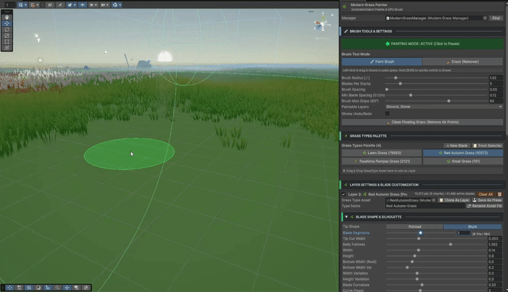
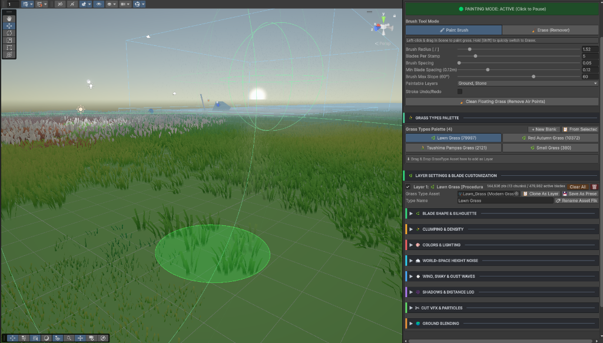

# Easy Grass Painter 🌾

A high-performance, GPU-driven procedural stylized grass system for **Unity Universal Render Pipeline (URP)**.



## ✨ What You Can Do

- 🖌️ **In-Editor Scene Painting**: Paint, erase, and sculpt multi-species grass layers directly on terrains and meshes with customizable slope limits.
- ⚡ **GPU-Driven Performance**: Render hundreds of thousands of procedural grass blades at silky-smooth framerates using compute shaders and indirect instancing.
- ✂️ **Real-Time Cutting & Regrowth**: Cut grass dynamically with weapons or tools with flying particle shred VFX and regrowth brush support.
- 💥 **Explosions & Shockwaves**: Radial expanding wavefronts that violently flatten grass at the crest with damped harmonic spring recoil in the wake.
- 🌪️ **Wind Zones & Rotor Wash**: Conical directional wind blasts and 360° continuous downward wash for helicopters, fans, and aura charging with smooth release recoil.
- 🏃 **Dynamic Player Interaction**: Grass bends and pushes away realistically as characters, animals, and objects move through the field.
- 🎨 **Deep Visual Customization**: Full artist control over wind waves, two-tone color gradients, blade curvature, clumping, and distance LOD culling.



## 📥 Installation (Unity Package Manager)

1. In Unity, open **Package Manager** (`Window > Package Manager`).
2. Click **`+`** > **Add package from git URL...**
3. Paste the following URL:
```text
https://github.com/naymyomhan/Unity-Easy-Grass-Painter.git
```

## 📄 License

MIT License. Free to use in commercial and personal projects.
